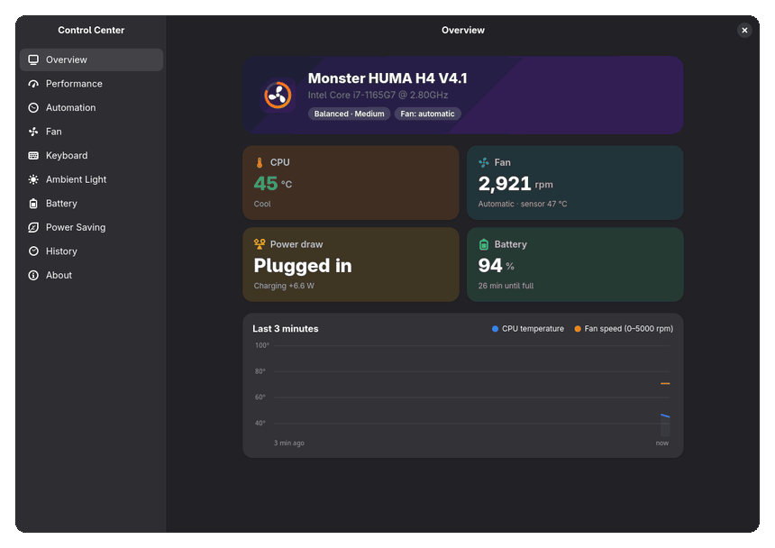
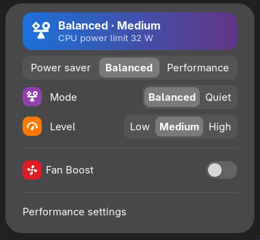
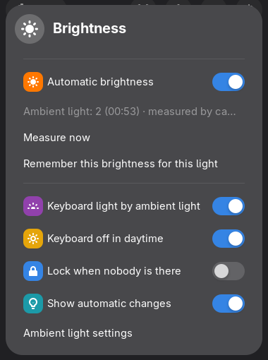
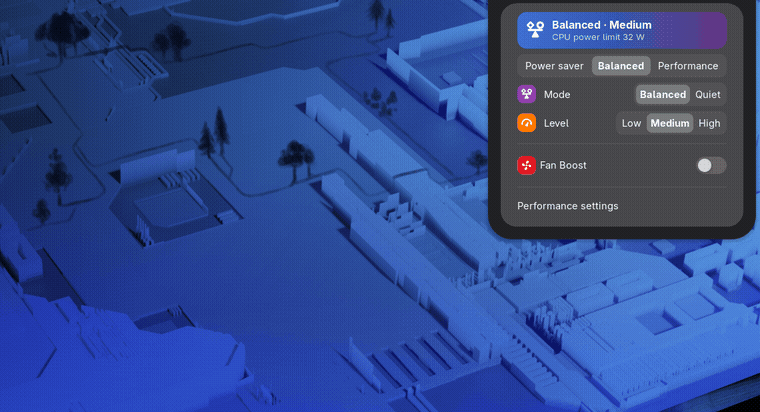

# Huma Control Center

**Unofficial control center for the Monster Huma H4 (Uniwill PH4TUX1) on Linux.**
Performance modes, fan control, keyboard backlight, charging settings and power
saving — the things the vendor's Windows-only Control Center does, as a Linux kernel
driver, a GTK 4 app and a GNOME Shell extension.

Huma Control Center is an independent community project. It is **not** Monster's
"Control Center" (Monster Control Center / Uniwill GamingCenter) and not a port of
it; it does not contain or run any vendor code.

*Türkçe özet aşağıda.*



> [!WARNING]
> **This software changes low-level hardware settings** (embedded controller writes:
> fans, CPU power limits, charging; optional UEFI change) and runs helpers as root.
> It is provided without any warranty. It only supports the model listed below and
> refuses to load on others. **Read [docs/SAFETY.md](docs/SAFETY.md) before installing.**
>
> Not affiliated with, endorsed by or supported by Monster Notebook, Uniwill or
> TUXEDO Computers. Trademarks belong to their owners.

## Supported hardware

| Tested | |
|---|---|
| Laptop | **Monster Huma H4 V4.1** (SKU H4V41PH4TUX1), Uniwill **PH4TUX1** platform, EC project id `0x13` |
| BIOS | N.1.15MON06 |
| CPU / GPU | Intel Core i7-1165G7 (Tiger Lake), Intel Iris Xe |
| OS | **Fedora Linux 44 Workstation**, kernel 7.2, GNOME 50 (Wayland) |

Full details: [docs/tested-hardware.md](docs/tested-hardware.md).

**Measured battery life:** YouTube 1080p in Firefox, looped full screen, brightness
~9 %, Wi-Fi on, *Balanced* power mode (runs as Quiet · 20 dB on battery):
**5 h 6 min from 98 % to 2 %, 7.9 W average** (the fan was off 93 % of the time).
Details in [docs/tested-hardware.md](docs/tested-hardware.md#battery-test).
Other distributions are not tested yet (the installer uses `dnf`). Other laptops on
the same platform (other Huma H4 variants, TUXEDO InfinityBook 14 Gen6 and similar
PH4TUX1 rebrands) are **not enabled**; if you own one, please run
[`tools/hw-report.sh`](tools/hw-report.sh) and open a *New model* issue.

## Features

**Performance and fan**
- Power modes Balanced / Quiet, each with Low / Medium / High levels (CPU power limit
  15–38 W) and the matching fan tables; integrates with GNOME's Power Mode
  (power-profiles-daemon / tuned-ppd): Power Saver, Balanced, Performance
- Fan Boost, live fan speed and temperatures
- Custom fan curve editor with safety validation (see [SAFETY](docs/SAFETY.md))
- Automatic profiles: by power source, night hours, or while a chosen app is running

**Keyboard**
- White backlight levels, Fn+F6 events, turn off when idle, start off during daytime
- Backlight follows the ambient light (dark room → on, bright → off)
- Windows-key lock, Fn lock, touchpad toggle key, microphone mute LED

**Battery and power saving**
- Charging profile (high capacity / balanced / stationary) and USB-C charging priority (Monster Control Center "Type-C Mode")
- Per-app battery usage estimate (CPU and GPU share while on battery)
- History of power draw, temperatures and modes (90 days)
- Power on when the charger is plugged in (UEFI), USB power while off
- Power-saving automations only on battery, with measured, low-wakeup services
- Power-saving profile on battery ("Balanced" runs like Power Saver, turbo off) and an
  SD card reader that sleeps when idle or is switched off completely
- Deep sleep (S3) while suspended: 0.44 W instead of 1.33 W with s2idle on this laptop

**Ambient light without a light sensor**
- The laptop has no light sensor: ambient light is measured with the webcam
  (a short, low-resolution capture; nothing is saved)
- Automatic screen brightness by ambient light, with per-light-level presets
- Optional *lock when nobody is there* using on-device face detection (YuNet),
  skipped in dark rooms and during video playback

**GNOME integration**
- Quick Settings: power mode with fine tuning and Fan Boost, brightness menu options
- On-screen display when the mode or power source changes; alerts as notifications
- Top bar button and the keyboard's Control Center key open the app

| Quick Settings | Brightness menu |
|---|---|
|  |  |



More screenshots: [overview](docs/screenshots/overview.png) ·
[performance](docs/screenshots/performance.png) · [fan curve](docs/screenshots/fan.png) ·
[keyboard](docs/screenshots/keyboard.png) · [ambient light](docs/screenshots/ambient-light.png) ·
[battery](docs/screenshots/battery.png) (sample data) · [power saving](docs/screenshots/power-saving.png) · [automation](docs/screenshots/automation.png) ·
[history](docs/screenshots/history.png)

The app is in English and Turkish (follows the system language; can be changed in
*About → App language*).

## Install

Requirements: Fedora Linux 44 Workstation (GNOME, Wayland), `sudo` rights, internet
access for packages. Secure Boot is supported (you enroll a key on the next reboot).

```sh
git clone https://github.com/aygkhn/huma-control.git
cd huma-control
./install.sh
```

The installer checks the model, shows the safety notice once and asks you to accept
it, then:

1. installs `dkms`, `kernel-devel`, `gettext`, `v4l-utils`, `ffmpeg-free` with `dnf`;
2. builds and installs the `qc71_laptop` kernel module with DKMS (rebuilt on kernel
   updates) and signs it for Secure Boot;
3. installs the root helpers to `/usr/local/libexec/`, two systemd services, udev and
   polkit rules;
4. installs the app to `~/.local/bin`, the GNOME Shell extension to
   `~/.local/share/gnome-shell/extensions/`, and translations;
5. optionally sets up OpenCV in a private virtual environment for the presence check;
6. installs the power-saving component: `huma-control-power` (root helper), the
   `huma-control-battery` tuned profile and SD card reader udev rules. On the first
   install the card reader is set to sleep when idle and "Balanced" uses the power-saving
   profile on battery; both can be changed on the Power Saving page. Skip the component
   with `./install.sh --no-power-saving`.

Log out and back in afterwards so GNOME loads the extension.

**Uninstall:** `./install.sh --uninstall` removes the module, services, helpers, app,
extension and settings. Settings already stored in the embedded controller stay until
changed (see [SAFETY](docs/SAFETY.md)).

## How it works

```
GNOME Shell extension ─┐                         ┌─ huma-control-service   (automatic profiles, history,
GTK app ───────────────┼─ pkexec → helper ─┐     │                         alerts, battery usage)
                       │                    ├─ sysfs ─ qc71_laptop kernel module ─ ACPI-WMI ─ embedded controller
                       └─ platform_profile ─┘     └─ huma-control-keyboard  (keyboard backlight, ambient light)
```

- `driver/` — kernel module, a fork of [qc71_laptop](https://github.com/pobrn/qc71_laptop)
  with PH4TUX1 support (model table, performance profiles, fan tables, charging),
  GPL-2.0-only. See [driver/README.md](driver/README.md).
- `system/` — root helpers, services, udev/polkit rules, camera tools.
- `app/` — the GTK 4 / libadwaita app.
- `huma-control@aygkhn.github.io/` — the GNOME Shell extension.
- `docs/` — [EC register map](docs/ec-register-map.md), [safety](docs/SAFETY.md),
  [tested hardware](docs/tested-hardware.md).
- `tools/hw-report.sh` — collects non-identifying hardware info for new models.

## Contributing

Bug reports, hardware reports and translations are welcome — see
[CONTRIBUTING.md](CONTRIBUTING.md). Security issues: [SECURITY.md](SECURITY.md).

## Credits and license

- Kernel driver based on **qc71_laptop** by Barnabás Pőcze (via the Slimbook fork);
  register knowledge cross-checked with TUXEDO's `tuxedo-drivers` and the upstream
  `uniwill-laptop` driver. Face detection model: **YuNet** (OpenCV Zoo, MIT).
  Details: [THIRD_PARTY.md](THIRD_PARTY.md).
- License: **GPL-2.0-or-later**; the kernel driver in `driver/` is **GPL-2.0-only**.
  See [COPYING](COPYING) and [LICENSES/](LICENSES/).
- © 2026 Gokhan AY

---

## Türkçe

**Huma Control Center**, Monster Huma H4 (Uniwill PH4TUX1) için Linux'ta çalışan, resmi
olmayan bir kontrol merkezidir: performans modları (15–38 W), Fan Boost ve özel fan
eğrisi, klavye ışığı (boşta kapanma, ortam ışığına göre), şarj profili ve önceliği,
uygulama bazında pil kullanımı, ışık sensörü olmayan bu dizüstünde kamerayla ortam
ışığı ölçüp otomatik ekran parlaklığı ve GNOME Hızlı Ayarlar entegrasyonu.

- Yalnız **Monster Huma H4 V4.1, BIOS N.1.15MON06, Fedora Linux 44** üzerinde test
  edildi; başka modellerde sürücü yüklenmez.
- Ölçülen pil süresi: Firefox'ta YouTube 1080p, tam ekran, döngüde, parlaklık ~%9:
  **%98 → %2 arası 5 saat 6 dakika, ortalama 7,9 W**.
- Kurmadan önce **[güvenlik uyarısını](docs/SAFETY.md)** okuyun: yazılım düşük seviyeli
  donanım ayarlarını değiştirir ve hiçbir garanti vermez.
- Kurulum: `./install.sh` · Kaldırma: `./install.sh --uninstall`
- Arayüz Türkçe ve İngilizce; sistem diline uyar, *Bilgi → Uygulama dili* ile
  değiştirilebilir.
- Bağımsız bir topluluk projesidir; Monster'ın Windows'taki "Control Center"
  uygulaması değildir. Monster Notebook, Uniwill ya da TUXEDO ile bağlantısı yoktur.
